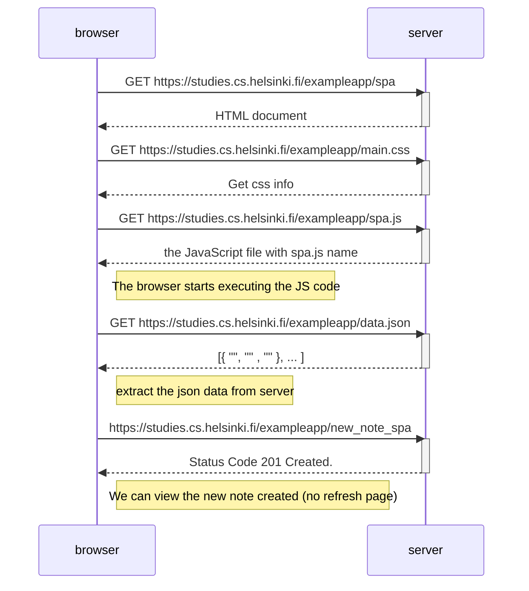

```mermaid

sequenceDiagram
    
    participant browser
    participant server

    browser->>server: GET https://studies.cs.helsinki.fi/exampleapp/spa
    activate server
    server -->>browser: HTML document
    deactivate server

    browser->>server: GET https://studies.cs.helsinki.fi/exampleapp/main.css 
    activate server
    server-->>browser: Get css info
    deactivate server

    browser->>server: GET https://studies.cs.helsinki.fi/exampleapp/spa.js
    activate server
    server-->>browser: the JavaScript file with spa.js name
    deactivate server
    Note right of browser: The browser starts executing the JS code 

    browser->>server: GET https://studies.cs.helsinki.fi/exampleapp/data.json
    activate server
    server-->>browser: [{ "", "" , "" }, ... ]
    deactivate server
    Note right of browser: extract the json data from server

    browser->>server: https://studies.cs.helsinki.fi/exampleapp/new_note_spa
    activate server
    server-->>browser: Status Code 201 Created. 
    deactivate server
    Note right of browser: We can view the new note created (no refresh page)
```